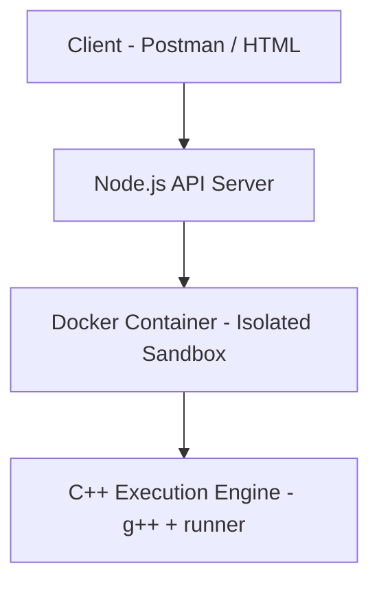

# PRODUCT REQUIREMENTS DOCUMENT (PRD)

## Project Title
Dockerized Online Code Evaluation System

## Objective
The objective of this project is to design and implement a secure, scalable, and containerized online code evaluation system that can compile and execute user-submitted C++ programs against predefined test cases, measure performance, and return accurate verdicts.

The system emulates the core backend execution pipeline of competitive programming platforms such as Codeforces and LeetCode, with emphasis on:
- System design
- Process isolation
- Resource control
- Clean backend architecture

## Target Users
- Computer Science students practicing DSA
- Educators evaluating programming assignments
- Developers testing algorithmic solutions

## Scope of the Project

### ✅ In Scope (MVP)
- REST API for code submission
- Compilation and execution of C++ code
- Automated multi-testcase evaluation
- Docker-based sandboxed execution
- Execution time measurement
- Structured verdict generation
- JSON-based API responses

### ❌ Out of Scope (MVP)
- Authentication & authorization
- Web UI (Postman / simple HTML only)
- Multi-language support (Java/Python)
- Plagiarism detection
- Distributed execution

## System Overview
The system is composed of three clearly separated layers:
1. **API Layer (Node.js + Express)**: Handles incoming requests, validates input, orchestrates execution, and returns responses.
2. **Execution Layer (Docker + C++)**: Executes user-submitted code inside isolated Docker containers with strict resource limits.
3. **Host OS Layer**: Provides Docker runtime and filesystem management.

## High-Level Architecture


## Execution Flow
1. Client submits code via REST API
2. Node.js server:
    - Stores submission temporarily
    - Invokes Docker container
3. Docker container:
    - Compiles the submitted code
    - Executes it against test cases
    - Measures execution time
    - Results are returned to Node.js
4. Node.js sends final verdict as JSON
5. Container is destroyed after execution

## Functional Requirements
- **FR-1: Code Submission**: Accept code submissions via REST API (language, source code, problem ID).
- **FR-2: Code Compilation**: Compile submitted code using g++ inside the Docker container. Capture compilation errors.
- **FR-3: Code Execution**: Execute compiled code against multiple predefined test cases using standard input redirection.
- **FR-4: Verdict Generation**: Generate verdicts: Accepted (AC), Wrong Answer (WA), Compilation Error (CE), Runtime Error (RE), Time Limit Exceeded (TLE).
- **FR-5: Performance Measurement**: Measure execution time using high-resolution timers. Enforce maximum execution time per test case.
- **FR-6: API Response**: Return structured JSON response (verdict, passed/total cases, execution time, error message).
- **FR-7: Containerized Execution**: Each submission in a new Docker container.
- **FR-8: Resource Constraints**: Enforce CPU, memory limits, and no network access.

## Non-Functional Requirements
- **NFR-1: Security**: Isolation using Docker, no network access, read-only filesystem where possible.
- **NFR-2: Performance**: Minimal Docker overhead, reliable sequential handling.
- **NFR-3: Reliability**: Cleanup of temporary files, graceful failure recovery.
- **NFR-4: Maintainability**: Modular code, clear separation of concerns.
- **NFR-5: Reproducibility**: Consistent environment via Docker.

## API Specification
**Endpoint**: `/submit`
**Method**: `POST`

**Request Body**:
```json
{
  "language": "cpp",
  "code": "#include <iostream>...",
  "problemId": "sum"
}
```

**Success Response**:
```json
{
  "verdict": "Accepted",
  "passed": 5,
  "total": 5,
  "executionTime": "0.12s"
}
```

## Directory Structure
```
online-code-eval/
├── server/
│   └── src/
├── runner/
│   └── src/
├── testcases/
├── submissions/
├── docker/
└── README.md
```

## Technology Stack
- **API**: Node.js, Express
- **Execution Engine**: C++
- **Sandbox**: Docker
- **Compiler**: g++
- **OS Interface**: child_process
- **Testing**: Postman
